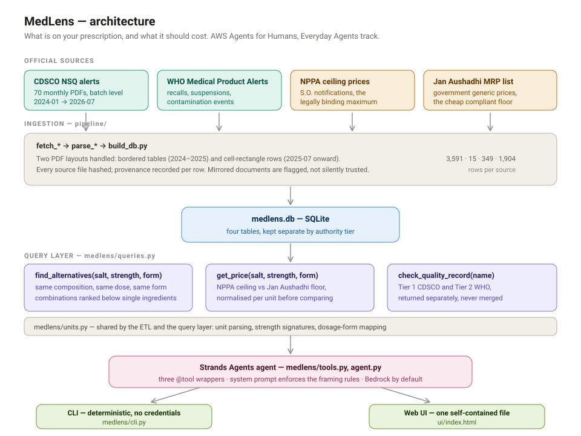

# Nuskha — what is on your prescription, and what it should cost

*Working title. Built for the AWS **Agents for Humans** hackathon (Everyday Agents track).*

A user types the salt on their prescription. The agent finds every same-composition
option, shows what the law says it may cost, and flags whether any of the
manufacturers involved have a recorded quality failure.

**Status: data layer + agent + UI.** Video outstanding.



```
pipeline/            data ingestion (see below)
nuskha/             the agent
  queries.py         the three query functions
  tools.py           Strands @tool wrappers
  agent.py           build_agent() + system prompt
  mock_model.py      scripted model, runs the real loop with no credentials
  cli.py             deterministic CLI + agent mode
ui/build_ui.py       generates the UI
ui/index.html        generated - self-contained, opens from the filesystem
docs/agent.md        how to run the agent
docs/aws-setup.md    Bedrock credentials and model access
docs/submission.md   the submission checklist
docs/architecture.svg the architecture diagram
```

## Quickstart

```bash
git clone https://github.com/junaidxgit/nuskha && cd nuskha
python -m nuskha.cli price atorvastatin 10mg   # works immediately - no pip, no AWS

pip install -r requirements.txt                # only needed for the agent
python -m nuskha.cli ask "what should atorvastatin 10mg cost, and is it any good?" \
    --offline --trace                          # the agent loop, no credentials needed
```

The SQLite database is built on demand from the tracked JSONL the first time you
run a query, so a fresh clone works with nothing but the standard library.

Two things worth knowing: the deterministic commands need **no third-party
package and no credentials**, and `ask --offline` drives the real Strands loop
with a scripted model, so the agent is reproducible without an AWS account.
Drop `--offline` to use a real Bedrock model.

```bash
python -m nuskha.cli check coldrif             # regulatory quality records
python -m nuskha.cli report atorvastatin 10mg  # price + quality together
python -m nuskha.cli check-bedrock             # diagnose AWS/Bedrock readiness
python -m nuskha.cli ask "..."                 # real agent, needs Bedrock access
python ui/build_ui.py                          # regenerate ui/ and docs/ HTML
python tests/test_agent_offline.py             # 19 checks, no credentials needed
```

## The UI

**Live: https://junaidxgit.github.io/nuskha/** — served by GitHub Pages from `docs/index.html`
on `main`; regenerating with `ui/build_ui.py` rewrites both copies.

`ui/index.html` is a single self-contained file — data embedded, no server, no build step.
Open it directly, or drop it on any static host for the live demo link. A demo that needs a
port and a working CORS setup is a demo that can fail on stage.

**Interaction:** instant search as you type, autocomplete over the 600 most common salts that
actually exist in the data (suggesting one that returns nothing is worse than no suggestion),
keyboard navigation on the dropdown, dosage-form filter, suggestion chips, a worked example on
load, shareable URL state (`?q=atorvastatin+10mg&f=tablet`), and a visual bar showing the gap
between the generic floor and the legal ceiling.

**Design, after looking at what exists.** sahidawa.in and firstscanit.com both do instant price
lookup well, so the lessons taken from them are the hero stat, the example visible on load, the
chips, and a visual comparison rather than two bare numbers. Neither carries the regulatory
record — that is the differentiator, so it gets equal billing rather than being a footnote under
the price. They search brand names; this cannot, and the UI says so plainly instead of silently
returning nothing.

It runs the same rules as the CLI: strength matching, dosage-form filtering, combination-product
detection, unit-normalised comparison, and the provenance caveat. The JavaScript `parseUnit` and
`strengthsOf` are ports of `nuskha/units.py`.

**Verified, not assumed:** `ui/test_ui.mjs` runs the page's own script under Node and asserts the
figures against the CLI. `node ui/test_ui.mjs` — checks the unit helpers, the autocomplete, the
stats wiring, six query cases, and the URL state. Currently all passing.

**Two traps worth knowing, both found by testing rather than reading:**

1. `\b` written unescaped inside a Python string literal becomes a literal **backspace**
   character (0x08). Python does *not* warn about this, unlike `\d`. It silently produced a
   regex that could never match, so `atorvastatin 10mg` failed to match a product called
   "Atorvastatin". `build_ui.py` now refuses to write output containing control characters.
2. A regex literal missing its closing `/` reads as correct to the eye. It took a byte dump
   to find.

---

## Why composition, not brand

Indian prescriptions already name the salt — a doctor writes *Tab Paracetamol 650*,
not *Dolo 650*. Starting from the salt removes the single hardest problem in this
domain: mapping brand names to compositions for Indian medicines requires a dataset
that does not exist publicly. Composition-first is not a compromise, it is how
prescriptions actually read.

## Why the alert is the product

Price comparison across Indian pharmacies is already commoditised (mymedisaathi,
medcompare.in, medikwise, medibachat, rxjinn). What nobody does is surface the
regulator's own quality record next to the price. That is the whole idea.

In Sept–Oct 2025, children died in Chhindwara, Madhya Pradesh after consuming
cough syrup contaminated with diethylene glycol. Reporting put the toll between
14 and 24. WHO identified the fatality cluster on **30 Sept 2025**, CDSCO reported
the DEG finding on **8 Oct**, and WHO published a public alert on **13 Oct** —
two weeks from signal to public warning. During those two weeks prescriptions were
still being filled.

The batches were in the regulatory record. Nobody holding a prescription could see it.

---

## Two data classes, deliberately never merged

An early version of this project assumed CDSCO's NSQ list was enough. It is not.
NSQ is a monthly list of batches that **failed laboratory testing**. Chhindwara was
a **recall plus production halt plus licence suspension** — a different document type
entirely. `--check coldrif` proves the point: zero NSQ hits, one WHO hit.

| class | what it is | source | status |
|---|---|---|---|
| NSQ batch alerts | batches that failed lab testing | CDSCO monthly PDFs | **built** — 1,598 records |
| Recalls / suspensions / contamination | enforcement action, product recalls | WHO Medical Product Alerts | **built** — 15 alerts |
| Bans / prohibitions | products prohibited from sale | CDSCO banned-drugs list | not built |

## What is built

```
pipeline/fetch_nsq.py          download CDSCO NSQ PDFs, 2024-01..2025-06   (Tier 1)
pipeline/parse_nsq.py          bordered-table layout -> 1,598 records       (Tier 1)
pipeline/fetch_nsq_recent.py   download CDSCO NSQ PDFs, 2025-07..2026-07   (Tier 1)
pipeline/parse_nsq_v2.py       cell-rect layout -> 1,993 records            (Tier 1)
pipeline/fetch_who.py          download WHO Medical Product Alerts          (Tier 2)
pipeline/parse_who.py          WHO text -> products / manufacturers / dates (Tier 2)
pipeline/fetch_nppa.py         NPPA ceiling prices from notification tables
pipeline/fetch_janaushadhi.py  Jan Aushadhi generic MRP list
pipeline/build_db.py           combined SQLite index + tiered lookup
```

## The price layer — what should this cost

Two official numbers, and the gap between them is the product.

**NPPA ceiling price** is the legally binding maximum retail price for a *scheduled
formulation* under the Drugs (Prices Control) Order, 2013. Charging above it is illegal.
349 rows across 23 notifications, 206 distinct formulations, each carrying the composition
and the S.O. notification reference.

**Jan Aushadhi MRP** is the government's own generic price. 1,904 products with drug code,
composition, pack size and price.

Together they answer the question directly:

```
$ python pipeline/build_db.py --price "atorvastatin"

[CEILING] NPPA scheduled formulation - legally binding maximum
  Atorvastatin
    composition Tablet 10 mg
    ceiling     Rs 4.94 per 1 tablet
    notice      S.O. 5498 (E) (2024-12)

[FLOOR] Jan Aushadhi generic - government-set price
  Rs 8.8 per 10's   Atorvastatin Tablets IP 10mg  (= Rs 0.88 per tablet)

  Comparable per-unit (tablet):
    tablet    floor Rs 0.88   ceiling Rs 4.94   (floor below ceiling)
```

A 5.6x gap between the government's own generic price and the legal ceiling, both figures
official, on one screen. That is the number to open the demo with.

**A correctness trap worth knowing about.** The two sources quote prices in different
units — NPPA says "per 1 Capsule", Jan Aushadhi says "per 10's". Comparing those raw
figures produced a nonsense range with the floor *above* the ceiling. `parse_unit()`
normalises both to a per-unit basis and only compares when the unit kinds match
(tablet/capsule/ml/g), printing a sanity verdict so the bug cannot come back silently.

**Tier 1 — CDSCO NSQ, 2024-01 → 2026-07:** 70 PDFs, **3,591 records**, 2024: 699 ·
2025: 1,831 · 2026: 1,061.

| field | 2024–2025 set | 2025–2026 set |
|---|---|---|
| product_name | 99.9% | **100.0%** |
| batch_no | 99.4% | **100.0%** |
| manufacturer | 100.0% | 98.6% |
| nsq_reason | 99.7% | 98.6% |
| reported_by | 99.6% | 98.6% |
| expiry_date | 97.2% | 98.3% |
| mfg_date | 96.9% | **98.4%** |

**Independently validated.** The parser's monthly totals were checked against
trade-press counts published independently of this work — **7 of 8 months match
exactly** (2025-07: 143, 2025-08: 94, 2025-10: 211, 2025-11: 205, 2025-12: 167,
2026-06: 159, 2026-07: 239). The one difference, 2026-05 at 159 vs 157, is the two
spurious-drug records in that file, which are not NSQ samples.

**Tier 2 — WHO alerts:** 15 alerts (2024 → 2026), full text extracted, 5 mentioning
India. 11 have product names extracted, 4 have manufacturer names. Covers N°5/2025,
which names COLDRIF (Sresan Pharmaceutical), Respifresh TR (Rednex Pharmaceuticals)
and ReLife (Shape Pharma).

## Run it

```bash
PY=python    # or your interpreter; `python -m nuskha.cli ...` works as-is

$PY pipeline/fetch_nsq.py --since 2024-01        # ~4 min, 45 PDFs
$PY pipeline/parse_nsq.py                        # ~3 min
$PY pipeline/fetch_nsq_recent.py --since 2025-07 # ~1 min, 25 PDFs
$PY pipeline/parse_nsq_v2.py                     # ~5 min
$PY pipeline/fetch_who.py --since 2024           # ~1 min, 15 alerts
$PY pipeline/parse_who.py                        # structured fields
$PY pipeline/build_db.py --check "coldrif"       # tiered lookup
$PY pipeline/build_db.py --check "atorvastatin"
```

Outputs: `data/raw/nsq/*.pdf`, `data/raw/nsq_recent/*.pdf`, `data/raw/who/*.pdf`,
manifests with sha256 per file, and `data/processed/` JSONL + `nuskha.db`.

Sample output — the query only Tier 2 catches:

```
$ python pipeline/build_db.py --check "coldrif"

[TIER 1] CDSCO NSQ batch alerts - recorded by the regulator
         0 matching record(s)

[TIER 2] WHO Medical Product Alerts - published by WHO
         1 matching alert(s)
  Medical Product Alert N°5/2025: Substandard (contaminated) oral liquid medicines
    date    13 October 2025   india=yes
    products COLDRIF; Respifresh TR
    makers   Sresan Pharmaceutical; Rednex Pharmaceuticals; Shape Pharma
```

And a query that reaches into 2026:

```
$ python pipeline/build_db.py --check "atorvastatin"

[TIER 1] CDSCO NSQ batch alerts - recorded by the regulator
  Atorvastatin Tablets IP 10mg
    batch AV26072   mfg Apr-2026  exp Sep-2027
    maker  Eurokem Laboratories Pvt Ltd, C-25, SIDCO Pharmaceutical Complex, Alathur
    reason Dissolution
    source state / state alert 2026-07; lab: State Lab
```

---

## How the CDSCO site actually works

Reverse-engineered 2026-09-10, because nothing about it is guessable:

1. **Index** — `/opencms/opencms/en/Notifications/nsq-drugs/` lists every alert as
   `<a href='...download_file_division.jsp?num_id=<base64>'>` with a title and date.
2. **Wrapper** — that `num_id` URL returns a tiny HTML page containing an `<iframe>`.
3. **Real PDF** — the iframe `src` points at `/opencms/resources/.../UploadAlertsFiles/<code>.pdf`.

The published filenames are cryptic codes (`stnsqapr25.pdf`), so filename guessing
fails. Go through the index. The title text is inconsistent — "NSQ ALERT FOR THE
MONTH OF Feb-2025", "Not Of Standard of Quality (NSQ) ALERT FOR THE MONTH OF
April-2025", "List of Drugs ... declared as Not of Standard Quality" — so the parser
matches `<month> <year>` anywhere and falls back to the publish date, recording which
source it used (`month_source`) so a publish date is never presented as an alert month.

**Parsing gotchas already handled:**

- Tables are bordered; `pdfplumber.find_tables()` gives clean 8-column cells.
  Bucketing words by x-position fails — headers are centred, data is left-aligned,
  so every column shifts by one.
- Only page 1 carries a header; continuation pages are headerless, so the column
  mapping is carried across pages.
- Headers wrap mid-word ("Manufa cturing Date"), so whitespace is stripped before
  matching labels.
- Some PDFs are letter-spaced ("T e l a n g a n a"), so runs of single-character
  tokens are rejoined.

## The July-2025 format change

The layout changed at July 2025 and the 2024-era parser returns **zero** records against
it. Three things defeat the obvious approaches:

1. `find_tables()` returns ~19 tables per page, because every cell carries its own border
   and the table fragments into cell-sized pieces. Page 1 reports 18 columns, page 2
   reports 16, and the indices do not align.
2. pdfplumber cell tuples are `(x0, top, x1, bottom)` and carry **no text**, so cells must
   be cropped to be read. Cropping cells taken from the *fragmented tables* duplicates
   text, because those bboxes overlap.
3. Banding records from the S.No anchor's own `top` cuts records in half — the S.No is
   vertically centred in a 178pt-tall row.

**The unlock:** every record is a single row of ten tall, *non-overlapping* cell
rectangles. For record 1 of the May-2026 alert they all span `top=74.2 → bottom=252.1`
with x-ranges `72.4-114.2, 114.9-234.8, 235.2-288.8, 289.6-365.9, 366.7-415.6,
416.3-508.5, 509.3-588.5, 589.2-649.0, 649.7-709.5, 710.2-770.0`.

So the row grouping is given directly by the drawing rather than inferred: filter
`page.rects` to cell-sized rectangles, group by identical vertical extent, sort by x, and
crop each cell. Because the cells tile the row exactly, nothing overlaps and the text
comes out clean. `parse_nsq_v2.py` implements this.

One collision to know about: the source's own "Alert Month" column is also called
`alert_month`, which clobbers the numeric metadata field of the same name. It is renamed
`alert_period` in the parsed record.

## Known gaps

- **The price comparison is per-unit but not strength-matched.** `--price "metformin"`
  compares the cheapest Jan Aushadhi entry (250 mg) against the cheapest NPPA ceiling
  (a glimepiride combination). Both figures are real, but they are not the same product.
  The agent must match on strength before showing a range. This is the highest-priority
  correctness fix in the price layer.
- **NPPA coverage is partial.** 206 distinct formulations captured, against 907–935 in the
  full DPCO schedule. The notification tables embedded in the posts are sometimes truncated
  previews (a "71 formulations" post carrying 12 rows). The complete list needs the S.O.
  PDFs from nppa.gov.in directly.
- **Provenance is a mirror** for the price data too — NPPA tables via the trade press, the
  Jan Aushadhi list via a third-party PDF host. Both hashed, both flagged in the manifests.
- **Jan Aushadhi has no usable API.** The site is a React SPA; its product endpoint at
  `janaushadhi.gov.in:8443` returns HTTP 500 for every payload shape tried, and no
  predictable PDF path on the official host resolves. The mirror PDF is the fallback.
- 269 of the 1,904 Jan Aushadhi rows have MRP 0 — they are surgical appliances, not
  medicines. Filtered out of price answers with `mrp_inr > 0`.
- `alert_type` labelling is inconsistent between the two NSQ fetchers: the 2024 set tags
  state alerts as `nsq`, the 2025+ set tags them `state`. `series` is correct in both.
- WHO extraction is pattern-based and incomplete: 11 of 15 alerts yield product names,
  4 yield manufacturers, and N°5/2025 returns COLDRIF and Respifresh TR but misses ReLife.
- 16 pre-2025 NSQ files yield no records: the "spurious drugs" and older "other" alerts use
  a different table shape.
- Manufacturer normalisation is deliberately lossy (strips "Pvt/Ltd/Pharma/...").
  Retrieval only, never display.
- Occasional source typos and hyphenation survive ("Pharmaceuti cals", "MISBRANDE D").
  These are defects in the source PDFs.

## Guardrails (non-negotiable)

An NSQ finding is **batch-specific**. A firm with one flagged batch is not an
"adulterated manufacturer", and saying so is defamation. Therefore:

1. Show the batch number, alert month, exact stated reason, and a link to the source PDF.
2. Never score, rank, or editorialise. Mirror the government record.
3. State that absence from the list is **not** evidence of quality — only sampled
   batches are tested.
4. Never instruct a substitution. Composition match is not proven therapeutic
   equivalence; CDSCO does not require bioequivalence studies for domestically
   marketed generics. Persistent "not medical advice" disclaimer.
5. Government data only. Do not scrape commercial pharmacies — their terms forbid it,
   and the hackathon requires authorised use of all third-party data.

Full detail: `docs/data-sources.md`.
